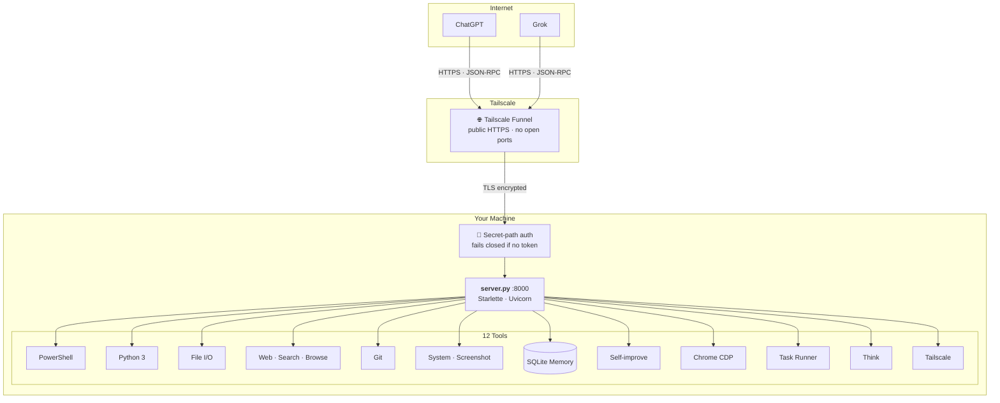

# funnel-mcp

> Turn any machine into an AI workstation. No cloud, no port forwarding, no public IP.
> Just Tailscale Funnel + a single Python file.

## The Problem

You want ChatGPT or Grok to control your PC — run commands, browse the web, manage files. But MCP servers need either local stdio (Claude Desktop only) or a public HTTPS endpoint (hard to set up, risky to expose).

## The Solution

Tailscale Funnel gives you a **free public HTTPS URL** without opening ports. Secret-path auth means only someone with the token can reach your server. One Python file, zero config.



## Quick Start

```bash
# 1. Install Tailscale + enable Funnel
tailscale up
tailscale funnel 8000

# 2. Generate a secret token
openssl rand -hex 16 > .funnel_token

# 3. Start the server
pip install starlette uvicorn
python server.py
```

Connect GPT/Grok to: `https://YOUR-MACHINE.tailXXXXX.ts.net/YOUR-TOKEN/`

## Tools

| Tool | Description |
|------|-------------|
| `run_command` | PowerShell with timeout, cwd, tail_lines |
| `run_python` | Python 3 execution with cwd |
| `file` | Read, write, append, list, tree, search, grep, stat, move, str_replace |
| `web` | Google/Bing/Wikipedia/DuckDuckGo search, fetch, Playwright browse, GitHub API |
| `git` | Status, log, diff, branch, show, remote, blame |
| `system` | Info, processes, ports, services, env, kill, screenshot (mss) |
| `memory` | Persistent SQLite key-value — `skill:*`, `insight:*`, `fact:*` |
| `self` | Review, backup, patch, heal, restart — **the server can improve itself** |
| `task` | Multi-step autonomous runner with stop-on-error |
| `browser` | Chrome CDP bridge — uses your logged-in sessions |
| `tailscale` | Status, IP, ping |

## Self-Improving

AI assistants can upgrade the server at runtime:

```
backup → file(str_replace) → heal → restart
```

No human needed. The `self` tool chain lets AI patch `server.py`, verify syntax, and restart — all from within a conversation.

## Security

| Layer | Mechanism |
|-------|-----------|
| Transport | Tailscale WireGuard — end-to-end encrypted |
| Access | Tailscale Funnel — no open ports, no NAT config |
| Auth | Secret-path token in URL — 32-char random string |
| Fail-safe | Server returns 503 if `.funnel_token` is missing |
| Git-safe | `.gitignore` blocks the token file |

> ⚠️ The full URL (domain + token) is the only key. Share it carefully.

## License

MIT
